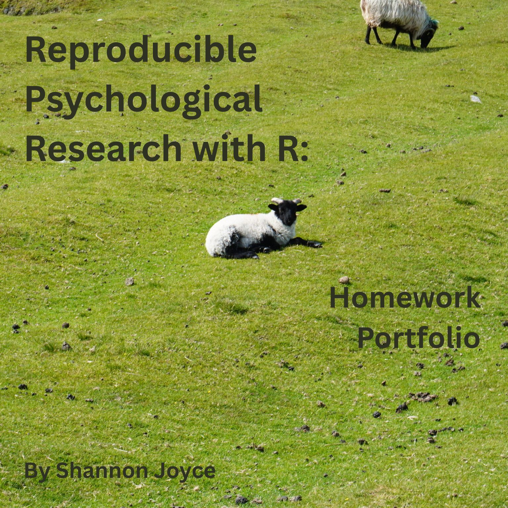

# About This Book {.unnumbered}

This is a compilation of all homework assignments that I have completed for my graduate class on Reproducible Psychological Research. In these assignments, I have successfully written and executed R scripts for data analysis, cleaned and wrangled datasets using reproducible workflows, created publication-quality figures using ggplot2, conducted and interpreted common statistical tests, communicated results through reproducible R Markdown documents, and applied open science practices.

## Index

### Preface: About This Book

### Chapter 1: NYC Shootings Insights

### Chapter 2: Law Firm Analysis

### Chapter 3: Sleep/Exercise Analysis

### Chapter 4: NBA Analytics

### Chapter 5: Florida Crime Analytics

### Chapter 6: Streaming Analytics

### Chapter 7: Wage Analytics

### Chapter 8: Shiny App

### Chapter 9: Final Reflection
